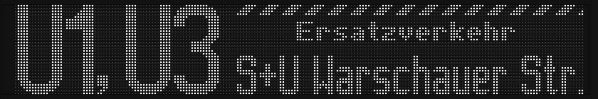

# Simple

## List of elements

| element | parant element | content type | default if omitted | description |
| --- | --- | --- | --- | --- |
| terminus | - | sub-elements | | Root element.<br>Has only one `<simple>`-element as sub-element. |
| simple | terminus | sub-elements | | Simple terminus configuration.<br>Has only one or more `<panel>`-elements as sub-elements. |
| panel | simple | sub-elements | | The configuration for one panel.<br>The elements will be assigned to the panels in the order of the slot ids. If the vehicle has more panels than there are `<panel>`-elements, the remaining will use the last element.<br>Has only one or more `<content>`-elements as sub-elements. |
| content | panel | sub-elements | | Contains everything that is visible on a panel at one time. If there are multiple `<content>`-elements, the panel will cycle through them.<br>Has at least the `<string1>`-element as sub-element. The other sub-elements are optional. |
| string1 | content | sub-elements | | First line or only line of the terminus. |
| string2 | content | sub-elements | | Second line of the terminus. |
| value | string1, string2 | string | | Mandatory sub-element with the actual string, that should be displayed. |
| inverted | string1, string2 | boolean | false | Optional sub-element, that inverts the string, if set to true. |
| inverted | content | string | none | Optional sub-element, that can invert the whole panel or parts of it. Possible values:<br>`none` - Nothing happens.<br>`line` - Inverts the line number.<br>`terminus` - Inverts the terminus.<br>`full` - Inverts the whole panel. |
| smallerstring | content | integer | 0 | Optional sub-element to print one string smaller than the other one.<br>`0` - Both strings have the same size.<br>`1` - The first string will be smaller.<br>`2` - The second string will be smaller.|
| time | content | single | 1 | Optional sub-element, that sets the time in seconds, how long this content is visible if the panel cycles through multiple `<content>`-elements.<br>Minimum is `1`. |

## Example

```xml
<terminus>
    <simple>
        <panel>
            <content>
                <string1>
                    <value>First line</value>
                    <inverted>true</inverted>
                </string1>
                <string2>
                    <value>Second line</value>
                </string2>
                <inverted>full</inverted>
                <smallerstring>1</smallerstring>
                <time>2</time>
            </content>
        </panel>
    </simple>
</terminus>
```

# Complex

## List of elements

| element | parant element | content type | default if omitted | description |
| --- | --- | --- | --- | --- |
| terminus | - | sub-elements | | Root element.<br>Has only one `<complex>`-element as sub-element. |
| complex | terminus | sub-elements | | Complex terminus configuration.<br>Has only one or more `<panel>`-elements as sub-elements. |
| panel | complex | sub-elements | | The configuration for one panel. It has either one or more `<content>`-elements or one `<defaults>`-element and optionally one `<noautoformat>`-element as sub-elements.<br>To which panel this configuration applies is defined by the attributes, see sttribute list for a description. |
| defaults | panel | boolean | false | If set to `true`, all `<content>`-elements are ignored and the panel shows the default strings from the basic PIS. |
| noautoformat | panel | boolean | false | If the global `auto_format` setting is enabled, this can overwrite that, by setting it to `true`. |
| content | panel | sub-elements | | Contains everything that is visible on a panel at one time. If there are multiple `<content>`-elements, the panel will cycle through them.<br>These elements can be copied via attributes (see attribute list), so that you do not have to write everything again, if there are only little changes from content to content. |
| time | content | single | 1 | Optional sub-element, that sets the time in seconds, how long this content is visible if the panel cycles through multiple `<content>`-elements.<br>Minimum is `1`. |
| inverted | content | string | none | Optional sub-element, that can invert the whole panel or parts of it. Possible values:<br>`none` - Nothing happens.<br>`line` - Inverts the line number.<br>`terminus` - Inverts the terminus.<br>`full` - Inverts the whole panel. |
| string | content | sub-elements | | Write a string onto the panel. There are copy-, delete- or modify-options with attributes (see attribute list). |
| tape | content | sub-elements | | Draw a tape onto the panel. It is the same as writing a string with a bunch of trapezoids, but without having to calculate how long the string must be and which spacing is needed.<br>There are copy-, delete- or modify-options with attributes (see attribute list). |
| box | content | sub-elements | | Draw a box onto the panel.<br>There are copy-, delete- or modify-options with attributes (see attribute list). |
| checkerboard | content | sub-elements | | Draw a checkerboard box onto the panel.<br>There are copy-, delete- or modify-options with attributes (see attribute list). |
| value | string | string | | The actual string. |
| font | string | string | | Font `name` that is used to write the string. See `[font]` section in groups strings or the list of available fonts. |
| spacing | string | integer | 0 | The string is written with this spacing. |
| unlockspacing | string | boolean | false | Allow the spacing to be reduced if the string is written with relative positioning inside an area. |
| inverted | string, checkerboard | boolean | false | Invert the the element. The area, that will be inverted is either the given area or an automatically created one around a string. |
| position | string, tape | sub-elements | | The position of the string. Absolute coordinates are given in the subelements `<x>` and `<y>`. If the element has an area, relative positioning is possible with the subelements `<halign>` and `<valign>`. |
| area | string, checkerboard | sub-elements | | This defines the area of the element inside the sub-elements `<x1>`, `<y1>`, `<x2>` and `<y2>`. The checkerboard will fill the whole area, a string can be positioned relative inside this area. This is also the area, that will be inverted, if the element is inverted.<br>The box has its own elements called `<outer>` and `<inner>`. |
| inner | box | sub-elements | | See `<area>`. If only this inner area is given without `<outer>`, the box will be filled and inside this area. |
| outer | box | sub-elements | | See `<area>`. This only works together with `<inner>` and it should be larger than that. If it is given, the box will not be filled with a border between `<outer>` and `<inner>`. |
| size | tape | integer | | The height of the tape. It must be `3` or `4`. |
| x | position | integer | 0 | x-coordinate of an absolute position. |
| y | position | integer | 0 | y-coordinate of an absolute position. |
| x1 | area, inner, outer | integer | 0 | x-coordinate of the upper left corner of an area. |
| y1 | area, inner, outer | integer | 0 | y-coordinate of the upper left corner of an area.|
| x2 | area, inner, outer | integer | 0 | x-coordinate of the lower right corner of an area. |
| y2 | area, inner, outer | integer | 0 | y-coordinate of the lower right corner of an area. |
| valign | position | string | top | Relative positioning inside an area with `top`, `middle` or `bottom`. Overwrites `<y>`. |
| halign | position | string | left | Relative positioning inside an area with `left`, `center` or `right`. Overwrites `<x>`. |

## List of attributes

| element | attribute | description |
| --- | --- | --- |
| panel | size | Mandatory! Sets the size of the panel, to which the element should be applied to. |
| panel | count | Sets the position or the count of the panel, to which the element should be applied to. See `count_is_id` setting in `[settings]` in the group strings. Omitting it, will always match. |
| panel | content | Sets the content of the panel, to which the element should be applied to. It can be `line`, `terminus` or `both`. Omitting it, will always match. |
| content, string, tape, box, checkerboard | id | Gives the element an ID, so that it can be referenced. |
| content, string, tape, box, checkerboard | cp | Copies the element with the given ID. Only works inside the same parent element. |
| string, tape, box, checkerboard | ref | Referencing an element with the given ID to modify its content. Only works inside the same parent element. |
| string, tape, box, checkerboard | del | Delete an element with the given ID. |

## Example



```xml
<terminus>
    <complex>
        <panel size="200x32">

            <content id="frontA">
                <time>4</time>
                <string>
                    <value>U1, U3</value>
                    <font>l32w</font>
                    <spacing>1</spacing>
                    <position>
                        <x>1</x>
                        <y>0</y>
                    </position>
                </string>
                <tape>
                    <size>4</size>
                    <length>136</length>
                    <spacing>4</spacing>
                    <position>
                        <x>78</x>
                        <y>0</y>
                    </position>
                </tape>
                <string id="frontStrA">
                    <value>Ersatzverkehr</value>
                    <font>t8</font>
                    <spacing>1</spacing>
                    <position>
                        <x>99</x>
                        <y>6</y>
                    </position>
                </string>
                <string>
                    <value>S+U Warschauer Str.</value>
                    <font>t15</font>
                    <spacing>1</spacing>
                    <position>
                        <x>78</x>
                        <y>18</y>
                    </position>
                </string>
            </content>

            <content cp="frontA">
                <string ref="frontStrA">
                    <value>Replacement service</value>
                    <position>
                        <x>87</x>
                        <y>6</y>
                    </position>
                </string>
            </content>

        </panel>
    </complex>
</terminus>
```